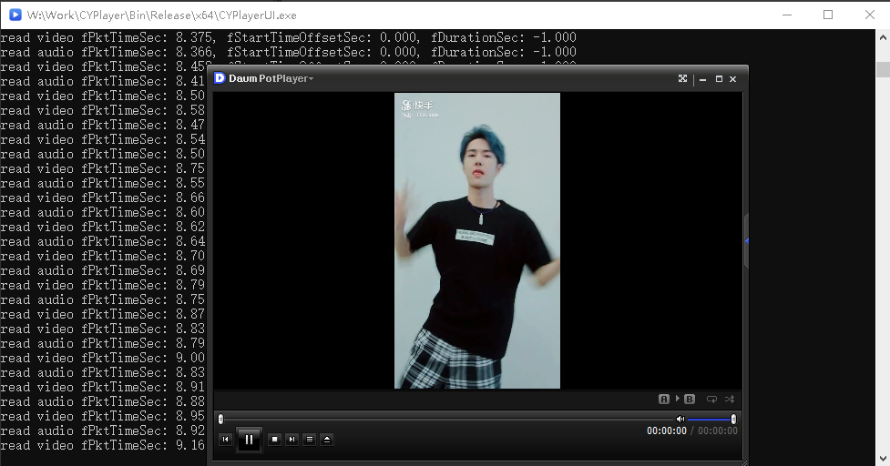

# CYPlayer

<div align="center">

**跨平台高效媒体播放器 SDK** | **Cross-platform Efficient Media Player SDK**

[](LICENSE)
[](https://isocpp.org/)
[](https://ffmpeg.org/)
[](https://www.libsdl.org/)

</div>

---

## 📖 目录 | Table of Contents

- [📝 简介 | Introduction](#-简介--introduction)
- [✨ 特性 | Features](#-特性--features)
- [🏗️ 架构 | Architecture](#️-架构--architecture)
- [🔧 构建 | Building](#-构建--building)
- [💡 使用示例 | Usage Examples](#-使用示例--usage-examples)
- [⚙️ 技术实现 | Technical Implementation](#️-技术实现--technical-implementation)
- [📚 接口文档 | API Reference](#-接口文档--api-reference)
- [🔌 扩展指南 | Extension Guide](#-扩展指南--extension-guide)
- [📄 许可 | License](#-许可--license)

## 📝 简介 | Introduction

**CYPlayer** 是一个轻量级、跨平台的媒体播放器 SDK，采用现代 C++11 实现，基于 FFmpeg 和 SDL 开发。它采用**责任链**设计模式，提供模块化和可扩展的播放架构，适用于需要在各种平台上实现高质量媒体播放功能的应用程序。

**CYPlayer** is a lightweight, cross-platform media player SDK implemented in modern C++11, based on FFmpeg and SDL. It adopts the **Chain of Responsibility** design pattern, offering a modular and extensible playback architecture suitable for applications requiring high-quality media playback capabilities across various platforms.

### 🖼️ 界面预览 | Interface Preview

<div align="center">
  
  
</div>

*完全兼容 PotPlayer 皮肤 | Fully compatible with PotPlayer skins*

## ✨ 特性 | Features

| 🏗️ 架构特性 | 🎵 媒体支持 | 🚀 性能优化 | 🔧 开发友好 |
|------------|------------|------------|------------|
| **模块化架构** - 责任链模式，组件职责明确 | **广泛格式支持** - FFmpeg 支持几乎所有主流格式 | **高性能渲染** - SDL 高效视频渲染 | **纯 C++11** - 无外部绑定依赖 |
| **易于扩展** - 可插入自定义过滤器 | **跨平台兼容** - Windows、macOS、Linux | **硬件加速** - 多种硬件加速方案 | **事件回调** - 丰富的事件通知机制 |
| **灵活设计** - 可替换核心组件 | **多流支持** - 音频、视频、字幕 | **多线程处理** - 解码渲染并行 | **智能内存管理** - RAII 和智能指针 |

### 🎯 核心优势

- 🎬 **专业级播放** - 支持各种媒体格式和编码
- ⚡ **高性能** - 硬件加速和多线程优化
- 🔌 **高度可扩展** - 责任链模式，易于定制
- 🌍 **跨平台** - 统一 API，多平台支持
- 🛠️ **开发友好** - 清晰接口，完善文档

## 🏗️ 架构 | Architecture

CYPlayer 的设计核心是灵活的处理过滤器链，每个组件都有明确且独立的职责。这种设计使得 SDK 易于扩展和维护。

### 🔗 过滤器链结构 | Filter Chain Structure

```
┌─────────────────┐    ┌─────────────────┐    ┌─────────────────┐    ┌─────────────────┐    ┌─────────────────┐
│  SourceFilter   │───▶│  DemuxFilter    │───▶│  DecodeFilter   │───▶│  ProcessFilter  │───▶│  RenderFilter   │
│   输入源处理    │    │    流解复用     │    │   音视频解码    │    │    后处理效果   │    │    渲染输出     │
└─────────────────┘    └─────────────────┘    └─────────────────┘    └─────────────────┘    └─────────────────┘
```

### 📋 组件职责 | Component Responsibilities

| 过滤器 | 主要功能 | 关键特性 |
|--------|----------|----------|
| **SourceFilter** | 处理输入源 | 本地文件、网络流、自定义数据源 |
| **DemuxFilter** | 流解复用 | 分离音视频流，提取元数据 |
| **DecodeFilter** | 媒体解码 | 硬件加速，多格式支持 |
| **ProcessFilter** | 后处理 | 视频效果、音频处理、格式转换 |
| **RenderFilter** | 渲染输出 | SDL 渲染，硬件加速，同步控制 |

### 🔄 数据流程 | Data Flow

```
📁 媒体文件 → 📦 数据包 → 🎬 解码帧 → 🎨 处理帧 → 🖥️ 渲染输出
     ↓           ↓          ↓          ↓          ↓
   打开文件    解复用流    解码数据    应用效果    显示播放
```

## 🔧 构建 | Building

### 📋 先决条件 | Prerequisites

确保您的系统上安装了以下组件:

| 组件 | 版本要求 | 用途 |
|------|----------|------|
| **CMake** | 3.10+ | 构建系统 |
| **编译器** | C++14 支持 | MSVC、GCC、Clang |
| **FFmpeg** | 4.x+ | 媒体解码 |
| **SDL2** | 2.x | 音视频渲染 |

### 🚀 快速构建 | Quick Build

#### 🪟 Windows

```bash
# 创建构建目录
mkdir build && cd build

# 配置 CMake
cmake .. -DCMAKE_BUILD_TYPE=Release

# 构建
cmake --build . --config Release
```

**Visual Studio 用户:**
```bash
# 生成 VS 解决方案
cmake .. -G "Visual Studio 17 2022" -A x64

# 打开解决方案
start CYPlayer.sln
```

#### 🍎 macOS & 🐧 Linux

```bash
# 创建构建目录
mkdir build && cd build

# 配置并构建
cmake .. -DCMAKE_BUILD_TYPE=Release
make -j$(nproc)  # Linux
make -j$(sysctl -n hw.ncpu)  # macOS
```

### ⚙️ 配置选项 | Configuration Options

#### 自定义依赖路径
```bash
cmake .. \
    -DFFMPEG_ROOT_DIR=/path/to/ffmpeg \
    -DSDL2_ROOT_DIR=/path/to/sdl2
```

#### 构建参数
| 参数 | 默认值 | 说明 |
|------|--------|------|
| `CMAKE_BUILD_TYPE` | `Debug` | `Debug` 或 `Release` |
| `BUILD_TESTS` | `OFF` | 是否构建测试 |
| `FFMPEG_ROOT_DIR` | - | FFmpeg 安装路径 |
| `SDL2_ROOT_DIR` | - | SDL2 安装路径 |

### 📦 安装 | Installation

```bash
# 安装到指定目录
cmake --install . --prefix /usr/local
```

**安装内容:**
- 📚 头文件: `<prefix>/include/`
- 🔧 库文件: `<prefix>/lib/`
- 📄 配置文件: `<prefix>/share/`

## 💡 使用示例 | Usage Examples

### 🎬 快速开始 | Quick Start

```cpp
#include "CYPlayer.hpp"

int main() {
    // 1️⃣ 创建播放器实例
    cry::ICYPlayer* player = cry::CYPlayerFactory::CreatePlayer();
    
    // 2️⃣ 配置播放器参数
    cry::EPlayerParam playerParam;
    playerParam.eClockType = cry::TYPE_SYNC_CLOCK_AUDIO;
    playerParam.eVideoRenderType = cry::TYPE_VIDEO_RENDER_SDL;
    playerParam.eAudioRenderType = cry::TYPE_AUDIO_RENDER_SDL;
    
    // 3️⃣ 初始化播放器
    player->Init(&playerParam);
    
    // 4️⃣ 设置渲染窗口 (Windows)
    #ifdef _WIN32
    player->SetWindow(hWnd);
    #endif
    
    // 5️⃣ 设置事件回调
    player->SetEventCallback(PlayerEventCallback);
    player->SetStateCallback(PlayerStateCallback);
    player->SetPositionCallback(PlayerPositionCallback);
    
    // 6️⃣ 打开媒体文件
    cry::EPlayerMediaParam mediaParam;
    mediaParam.nStartVolume = 100;  // 初始音量
    mediaParam.nLoop = 1;           // 循环播放
    player->Open("video.mp4", &mediaParam);
    
    // 7️⃣ 开始播放
    player->Play();
    
    // 8️⃣ 播放控制
    player->Seek(30000);        // 跳转到30秒
    player->SetVolume(0.8f);    // 设置音量80%
    
    // 9️⃣ 清理资源
    player->Stop();
    player->UnInit();
    cry::CYPlayerFactory::DestroyPlayer(player);
    
    return 0;
}
```

### 📞 事件回调 | Event Callbacks

```cpp
// 🎯 事件回调 - 处理播放事件
void PlayerEventCallback(const cry::EPlayerEventInfo* eventInfo) {
    if (!eventInfo) return;
    
    switch (eventInfo->eEventType) {
        case cry::TYPE_EVENT_PLAYBACK_FINISHED:
            std::cout << "✅ 播放完成" << std::endl;
            break;
        case cry::TYPE_EVENT_ERROR_OCCURRED:
            std::cout << "❌ 错误: " << eventInfo->nErrorCode 
                      << " - " << eventInfo->szMessage << std::endl;
            break;
        case cry::TYPE_EVENT_BUFFERING_START:
            std::cout << "⏳ 开始缓冲..." << std::endl;
            break;
        case cry::TYPE_EVENT_BUFFERING_END:
            std::cout << "🎬 缓冲完成，继续播放" << std::endl;
            break;
    }
}

// 🔄 状态回调 - 播放器状态变化
void PlayerStateCallback(cry::EStateType state) {
    const char* stateStr = "";
    switch (state) {
        case cry::TYPE_STATUS_PLAYING:  stateStr = "▶️ 播放中"; break;
        case cry::TYPE_STATUS_PAUSED:   stateStr = "⏸️ 已暂停"; break;
        case cry::TYPE_STATUS_STOPPED:  stateStr = "⏹️ 已停止"; break;
        case cry::TYPE_STATUS_LOADING:  stateStr = "⏳ 加载中"; break;
    }
    std::cout << "状态: " << stateStr << std::endl;
}

// 📍 位置回调 - 播放进度更新
void PlayerPositionCallback(int64_t position, int64_t duration) {
    double progress = (double)position / duration * 100;
    std::cout << "进度: " << std::fixed << std::setprecision(1) 
              << progress << "% (" << position/1000 << "s/" 
              << duration/1000 << "s)" << std::endl;
}
```

### 🎮 高级控制 | Advanced Control

```cpp
// 🎨 视频效果控制
player->SetVideoScale(cry::TYPE_VIDEO_SCALE_FIT);      // 适应屏幕
player->SetVideoRotation(cry::TYPE_ROTATION_90);       // 旋转90度
player->SetVideoMirror(true);                          // 水平镜像
player->SetAspectRatio(16.0f/9.0f);                    // 设置宽高比

// 🎵 音频控制
player->SetMute(true);                                 // 静音
player->SetSpeed(1.5f);                                // 1.5倍速播放
player->SetVolume(0.5f);                               // 50%音量

// ⏯️ 播放控制
bool isPaused = false;
player->Pause(&isPaused);                              // 暂停/恢复
player->Seek(60000);                                   // 跳转到1分钟
player->SetLoop(true);                                 // 循环播放
```

## ⚙️ 技术实现 | Technical Implementation

### 🏛️ 核心架构 | Core Architecture

CYPlayer 基于精心设计的**责任链过滤器架构**，每个过滤器在链中都有特定职责：

```
┌─────────────────────────────────────────────────────────────────────────────────┐
│                           核心架构类图 | Core Architecture Class Diagram          │
└─────────────────────────────────────────────────────────────────────────────────┘

┌─────────────────┐
│  CYBaseFilter   │◀───────────────────────────────────────────────────────┐
│  ─────────────  │                                                       │
│  +SetNext()     │                                                       │
│  +GetNext()     │                                                       │
│  +ProcessPacket()│                                                       │
│  +ProcessFrame() │                                                       │
└─────────────────┘                                                       │
        ▲                                                                │
        │                                                                │
        ├─────────┬─────────┬─────────┬─────────┬─────────┐               │
        │         │         │         │         │         │               │
        ▼         ▼         ▼         ▼         ▼         ▼               │
┌─────────────┐ ┌─────────────┐ ┌─────────────┐ ┌─────────────┐ ┌─────────────┐
│SourceFilter │ │DemuxFilter  │ │DecodeFilter │ │ProcessFilter│ │RenderFilter │
│  源过滤器   │ │解复用过滤器 │ │ 解码过滤器  │ │ 处理过滤器  │ │ 渲染过滤器  │
└─────────────┘ └─────────────┘ └─────────────┘ └─────────────┘ └─────────────┘

┌─────────────────────────────────────────────────────────────────────────────────┐
│                        ChainFilterManager                                       │
│                        ───────────────────                                      │
│                        +CreateFilters()                                         │
│                        +ConnectFilters()                                        │
│                        +ControlPlayback()                                       │
│                        +RouteCommands()                                         │
└─────────────────────────────────────────────────────────────────────────────────┘
        │
        ├─────────────────────────────────┐
        │                                 │
        ▼                                 ▼
┌─────────────────┐               ┌─────────────────┐
│  CYBaseFilter   │               │ CYMediaContext  │
│  过滤器基类     │               │  媒体上下文     │
└─────────────────┘               │  ─────────────  │
                                  │  +StreamInfo    │
                                  │  +PacketQueues  │
                                  │  +FrameQueues   │
                                  │  +ClockSync     │
                                  │  +FFmpegContext │
                                  │  +SDLResources  │
                                  └─────────────────┘
```

### 📦 关键组件 | Key Components

| 组件 | 职责 | 核心功能 |
|------|------|----------|
| **CYBaseFilter** | 过滤器基类 | 链式处理、数据传递 |
| **ChainFilterManager** | 中央协调器 | 过滤器管理、状态控制 |
| **CYMediaContext** | 媒体上下文 | 数据存储、资源管理 |

### 🔧 过滤器详解 | Filter Details

#### 📂 SourceFilter
- **职责**: 处理输入源
- **功能**: 打开文件/流、设置格式上下文
- **支持**: 本地文件、网络流、自定义数据源

#### 📦 DemuxFilter  
- **职责**: 流解复用
- **功能**: 分离音视频流、提取元数据
- **输出**: 独立的音频、视频、字幕流

#### 🎬 DecodeFilter
专门解码器家族：
- **CYAudioDecodeFilter**: 音频包 → 原始音频帧
- **CYVideoDecodeFilter**: 视频包 → 原始视频帧  
- **CYSubTitleDecodeFilter**: 字幕数据处理

#### 🎨 ProcessFilter
后处理操作：
- 视频缩放和格式转换
- 音频重采样和效果
- 帧率转换和同步

#### 🖥️ RenderFilter
渲染输出：
- **CYAudioRenderFilter**: SDL 音频播放
- **CYVideoRenderFilter**: SDL 视频渲染

### ⏱️ 同步机制 | Synchronization

**CYMediaClock** 系统确保精确同步：

```
┌─────────────────────────────────────────────────────────────────────────────────┐
│                         同步机制 | Synchronization Mechanism                    │
└─────────────────────────────────────────────────────────────────────────────────┘

    ┌──────────┐
    │ 音频时钟 │
    │AudioClock│
    └──────────┘
           │
           ▼
    ┌──────────┐      ┌───────────┐       ┌──────────┐
    │ 视频时钟 │─────▶│主时钟选择 │──────▶│ 外部时钟 │
    │VideoClock│      │MasterClock│       │ExtClock  │
    └──────────┘      └───────────┘       └──────────┘
                            │
                            ▼
                    ┌──────────────┐
                    │ 帧时序控制   │
                    │Frame Timing  │
                    └──────────────┘
                            │
                            ▼
                    ┌──────────────┐
                    │ 音视频同步   │
                    │AV Sync       │
                    └──────────────┘
                            │
                            ▼
                    ┌──────────────┐
                    │  渲染输出    │
                    │Render Output │
                    └──────────────┘
```

**同步模式:**
- 🎵 **音频主时钟** - 以音频为基准同步视频
- 🎬 **视频主时钟** - 以视频为基准同步音频  
- 🕐 **外部时钟** - 使用外部时间源

### 🚀 性能优化 | Performance Optimization

| 优化技术 | 实现方式 | 效果 |
|----------|----------|------|
| **硬件加速** | CYHWAccel | GPU 解码，降低 CPU 负载 |
| **多线程处理** | 线程池 | 并行解码和渲染 |
| **高效队列** | 无锁队列 | 减少线程同步开销 |
| **内存池** | 预分配缓冲 | 减少内存分配开销 |

### 🌍 跨平台支持 | Cross-Platform

**平台抽象层:**
```cpp
// 平台无关的窗口处理
#ifdef _WIN32
    // Windows 特定实现
#elif __APPLE__
    // macOS 特定实现  
#elif __linux__
    // Linux 特定实现
#endif
```

**统一渲染 API:**
- SDL 音频/视频输出
- 平台特定功能条件编译
- 统一的事件处理机制

### 🧠 内存管理 | Memory Management

**智能指针体系:**
```cpp
// 共享所有权
SharePtr<MediaFrame> frame;

// 独占所有权  
UniquePtr<FilterChain> chain;

// FFmpeg 资源管理
AVFreePtr<AVCodecContext> codecCtx;
AVNoFreePtr<AVFrame> frame;
```

**RAII 原则:**
- 自动资源释放
- 异常安全保证
- 避免内存泄漏

### 📡 事件系统 | Event System

| 回调类型 | 用途 | 触发时机 |
|----------|------|----------|
| **FunEventCallback** | 媒体事件 | 播放完成、错误、缓冲 |
| **FunStateCallBack** | 状态变化 | 播放/暂停/停止 |
| **FunPositionCallBack** | 进度更新 | 播放位置变化 |
| **FunLogCallBack** | 日志输出 | 调试信息输出 |

## 📚 接口文档 | API Reference

### 🏛️ 核心类 | Core Classes

| 类名 | 职责 | 关键特性 |
|------|------|----------|
| **ICYPlayer** | 主接口 | 客户端调用的统一接口 |
| **CYPlayerFactory** | 工厂类 | 创建和销毁播放器实例 |
| **CYPlayerImpl** | 实现类 | ICYPlayer 接口的具体实现 |

### 🎯 功能分类 | Feature Categories

#### 🎮 媒体控制 | Media Control
```cpp
int16_t Play();                           // ▶️ 播放
int16_t Pause(bool* bPaused);             // ⏸️ 暂停/恢复
int16_t Stop();                            // ⏹️ 停止
int16_t Seek(int64_t nTimestamp);         // ⏩ 跳转
```

#### 📊 状态查询 | Status Query
```cpp
EStateType GetState() const;              // 获取播放状态
int64_t GetDuration() const;              // 获取总时长
int64_t GetPosition() const;              // 获取当前位置
float GetVolume();                        // 获取当前音量
```

#### 🎵 音频控制 | Audio Control
```cpp
int16_t SetVolume(float fVolume);         // 🔊 设置音量 (0.0-1.0)
int16_t SetMute(bool bMute);              // 🔇 静音控制
int16_t SetSpeed(float fSpeed);           // ⚡ 播放速度
```

#### 🎬 视频控制 | Video Control
```cpp
int16_t SetVideoScale(EVideoScaleType eScale);     // 📐 缩放模式
int16_t SetVideoRotation(ERotationType eRotation); // 🔄 旋转角度
int16_t SetVideoMirror(bool bMirror);              // 🪞 镜像效果
int16_t SetAspectRatio(float fRatio);               // 📏 宽高比
```

#### ⚙️ 高级设置 | Advanced Settings
```cpp
int16_t SetLoop(bool bLoop);               // 🔁 循环播放
int16_t SetWindow(void* hWnd);             // 🖥️ 设置渲染窗口
```

### 📞 回调接口 | Callback Interfaces

```cpp
// 🎯 事件回调
typedef std::function<void(const EPlayerEventInfo*)> FunEventCallback;
int16_t SetEventCallback(FunEventCallback callback);

// 🔄 状态回调  
typedef std::function<void(EStateType)> FunStateCallBack;
int16_t SetStateCallback(FunStateCallBack callback);

// 📍 位置回调
typedef std::function<void(int64_t, int64_t)> FunPositionCallBack;
int16_t SetPositionCallback(FunPositionCallBack callback);

// 📝 日志回调
typedef std::function<void(int, const char*)> FunLogCallBack;
int16_t SetLogCallBack(FunLogCallBack callback);
```

### 🎛️ 枚举类型 | Enum Types

#### 播放状态 | Player States
```cpp
enum EStateType {
    TYPE_STATUS_STOPPED,    // ⏹️ 已停止
    TYPE_STATUS_PLAYING,    // ▶️ 播放中
    TYPE_STATUS_PAUSED,     // ⏸️ 已暂停
    TYPE_STATUS_LOADING     // ⏳ 加载中
};
```

#### 视频缩放 | Video Scale Types
```cpp
enum EVideoScaleType {
    TYPE_VIDEO_SCALE_ORIGINAL,  // 原始大小
    TYPE_VIDEO_SCALE_FIT,       // 适应屏幕
    TYPE_VIDEO_SCALE_FILL,      // 填充屏幕
    TYPE_VIDEO_SCALE_STRETCH    // 拉伸填充
};
```

#### 旋转角度 | Rotation Types
```cpp
enum ERotationType {
    TYPE_ROTATION_0,    // 0度
    TYPE_ROTATION_90,   // 90度
    TYPE_ROTATION_180,  // 180度
    TYPE_ROTATION_270   // 270度
};
```

### 🔄 完整生命周期 | Complete Lifecycle

```cpp
// 1️⃣ 创建
cry::ICYPlayer* player = cry::CYPlayerFactory::CreatePlayer();

// 2️⃣ 初始化
cry::EPlayerParam param;
param.eClockType = cry::TYPE_SYNC_CLOCK_AUDIO;
player->Init(&param);

// 3️⃣ 配置
player->SetWindow(hWnd);
player->SetEventCallback(callback);

// 4️⃣ 打开媒体
cry::EPlayerMediaParam mediaParam;
player->Open("video.mp4", &mediaParam);

// 5️⃣ 播放控制
player->Play();
player->SetVolume(0.8f);
player->SetVideoScale(cry::TYPE_VIDEO_SCALE_FIT);

// 6️⃣ 清理
player->Stop();
player->UnInit();
cry::CYPlayerFactory::DestroyPlayer(player);
```

## 🔌 扩展指南 | Extension Guide

CYPlayer 的模块化设计使扩展变得简单直观。通过责任链模式，您可以轻松添加自定义功能。

### 🛠️ 扩展步骤 | Extension Steps

```
┌─────────────────────────────────────────────────────────────────────────────────┐
│                            扩展步骤 | Extension Steps                           │
└─────────────────────────────────────────────────────────────────────────────────┘

┌─────────────────┐    ┌─────────────────┐    ┌─────────────────┐    ┌─────────────────┐
│继承CYBaseFilter │───▶│ 实现虚拟方法    │───▶│  插入过滤器链   │───▶│    测试验证     │
│ Inherit Base    │    │Implement Virtual│    │Insert to Chain  │    │Test & Verify    │
│    Filter       │    │     Methods     │    │                 │    │                 │
└─────────────────┘    └─────────────────┘    └─────────────────┘    └─────────────────┘
```

### 📝 创建自定义过滤器 | Creating Custom Filters

#### 1️⃣ 基础模板 | Basic Template

```cpp
class MyCustomFilter : public cry::CYBaseFilter {
public:
    MyCustomFilter() = default;
    virtual ~MyCustomFilter() = default;

    // 🚀 初始化过滤器
    virtual int16_t Init(SharePtr<EPlayerParam>& ptrParam) override {
        // 自定义初始化逻辑
        m_bInitialized = true;
        return cry::ERR_SUCESS;
    }

    // 📦 处理数据包
    virtual int16_t ProcessPacket(SharePtr<CYMediaContext>& ptrContext, 
                                 AVPacketPtr& ptrPacket) override {
        if (!m_bInitialized) return cry::ERR_NOT_INITIALIZED;
        
        // 自定义包处理逻辑
        // ...
        
        // 传递给下一个过滤器
        if (GetNext()) {
            return GetNext()->ProcessPacket(ptrContext, ptrPacket);
        }
        return cry::ERR_SUCESS;
    }

    // 🎬 处理帧数据
    virtual int16_t ProcessFrame(SharePtr<CYMediaContext>& ptrContext, 
                                AVFramePtr& ptrFrame) override {
        if (!m_bInitialized) return cry::ERR_NOT_INITIALIZED;
        
        // 自定义帧处理逻辑
        int16_t result = ProcessCustomFrame(ptrContext, ptrFrame);
        if (result != cry::ERR_SUCESS) return result;
        
        // 传递给下一个过滤器
        if (GetNext()) {
            return GetNext()->ProcessFrame(ptrContext, ptrFrame);
        }
        return cry::ERR_SUCESS;
    }

private:
    bool m_bInitialized = false;
    
    // 🎨 自定义处理逻辑
    int16_t ProcessCustomFrame(SharePtr<CYMediaContext>& ptrContext, 
                              AVFramePtr& ptrFrame) {
        // 实现您的自定义逻辑
        return cry::ERR_SUCESS;
    }
};
```

### 🎨 扩展示例 | Extension Examples

#### 🖼️ 视频水印过滤器 | Video Watermark Filter

```cpp
class WatermarkFilter : public cry::CYBaseFilter {
public:
    WatermarkFilter(const std::string& imagePath) : m_watermarkPath(imagePath) {}
    
    virtual int16_t Init(SharePtr<EPlayerParam>& ptrParam) override {
        // 加载水印图片
        if (LoadWatermarkImage() != cry::ERR_SUCESS) {
            return cry::ERR_LOAD_FAILED;
        }
        return cry::ERR_SUCESS;
    }
    
    virtual int16_t ProcessFrame(SharePtr<CYMediaContext>& ptrContext, 
                                AVFramePtr& ptrFrame) override {
        if (!ptrFrame || ptrFrame->width <= 0) return cry::ERR_INVALID_PARAM;
        
        // 在视频帧上添加水印
        ApplyWatermark(ptrFrame);
        
        // 传递给下一个过滤器
        if (GetNext()) {
            return GetNext()->ProcessFrame(ptrContext, ptrFrame);
        }
        return cry::ERR_SUCESS;
    }

private:
    std::string m_watermarkPath;
    AVFramePtr m_watermarkFrame;
    
    int16_t LoadWatermarkImage() {
        // 实现图片加载逻辑
        return cry::ERR_SUCESS;
    }
    
    void ApplyWatermark(AVFramePtr& videoFrame) {
        // 实现水印叠加逻辑
        // 可以使用 FFmpeg 的滤镜或直接像素操作
    }
};
```

#### 🎵 音频均衡器过滤器 | Audio Equalizer Filter

```cpp
class AudioEqualizerFilter : public cry::CYBaseFilter {
public:
    AudioEqualizerFilter() {
        // 初始化均衡器参数
        memset(m_eqGains, 0, sizeof(m_eqGains));
    }
    
    void SetBandGain(int band, float gain) {
        if (band >= 0 && band < 10) {
            m_eqGains[band] = gain;
        }
    }
    
    virtual int16_t ProcessFrame(SharePtr<CYMediaContext>& ptrContext, 
                                AVFramePtr& ptrFrame) override {
        if (!ptrFrame || ptrFrame->format != AV_SAMPLE_FMT_FLTP) {
            // 传递给下一个过滤器
            if (GetNext()) {
                return GetNext()->ProcessFrame(ptrContext, ptrFrame);
            }
            return cry::ERR_SUCESS;
        }
        
        // 应用均衡器效果
        ApplyEqualizer(ptrFrame);
        
        // 传递给下一个过滤器
        if (GetNext()) {
            return GetNext()->ProcessFrame(ptrContext, ptrFrame);
        }
        return cry::ERR_SUCESS;
    }

private:
    float m_eqGains[10];  // 10段均衡器
    
    void ApplyEqualizer(AVFramePtr& audioFrame) {
        // 实现FFT或IIR滤波器均衡器
        // 对音频数据进行频域处理
    }
};
```

#### 📊 视频分析过滤器 | Video Analytics Filter

```cpp
class VideoAnalyticsFilter : public cry::CYBaseFilter {
public:
    struct AnalyticsData {
        float brightness;
        float contrast;
        int motionLevel;
        bool sceneChange;
    };
    
    const AnalyticsData& GetAnalytics() const { return m_analytics; }
    
    virtual int16_t ProcessFrame(SharePtr<CYMediaContext>& ptrContext, 
                                AVFramePtr& ptrFrame) override {
        if (!ptrFrame) return cry::ERR_INVALID_PARAM;
        
        // 分析视频帧
        AnalyzeFrame(ptrFrame);
        
        // 传递给下一个过滤器
        if (GetNext()) {
            return GetNext()->ProcessFrame(ptrContext, ptrFrame);
        }
        return cry::ERR_SUCESS;
    }

private:
    AnalyticsData m_analytics;
    AVFramePtr m_prevFrame;
    
    void AnalyzeFrame(AVFramePtr& frame) {
        // 计算亮度
        m_analytics.brightness = CalculateBrightness(frame);
        
        // 计算对比度
        m_analytics.contrast = CalculateContrast(frame);
        
        // 检测运动
        m_analytics.motionLevel = DetectMotion(frame, m_prevFrame);
        
        // 场景变化检测
        m_analytics.sceneChange = DetectSceneChange(frame, m_prevFrame);
        
        m_prevFrame = frame;  // 保存当前帧用于下次比较
    }
    
    float CalculateBrightness(AVFramePtr& frame);
    float CalculateContrast(AVFramePtr& frame);
    int DetectMotion(AVFramePtr& current, AVFramePtr& previous);
    bool DetectSceneChange(AVFramePtr& current, AVFramePtr& previous);
};
```

### 🔗 集成自定义过滤器 | Integrating Custom Filters

```cpp
// 创建自定义过滤器
auto watermarkFilter = std::make_shared<WatermarkFilter>("watermark.png");
auto eqFilter = std::make_shared<AudioEqualizerFilter>();
auto analyticsFilter = std::make_shared<VideoAnalyticsFilter>();

// 设置均衡器参数
eqFilter->SetBandGain(0, 2.0f);  // 低频增强
eqFilter->SetBandGain(9, 1.5f);  // 高频增强

// 构建过滤器链
watermarkFilter->SetNext(eqFilter);
eqFilter->SetNext(analyticsFilter);

// 将自定义链插入到现有链中
// 这需要在 ChainFilterManager 中进行适当的修改
```

### 💡 最佳实践 | Best Practices

| ✅ 推荐做法 | ❌ 避免做法 |
|------------|------------|
| 保持过滤器单一职责 | 在一个过滤器中实现多种功能 |
| 正确处理错误情况 | 忽略错误返回值 |
| 及时释放资源 | 内存泄漏 |
| 充分测试边界条件 | 只测试正常情况 |
| 文档化自定义接口 | 缺少说明文档 |

### 🧪 测试自定义过滤器 | Testing Custom Filters

```cpp
// 单元测试示例
void TestWatermarkFilter() {
    auto filter = std::make_shared<WatermarkFilter>("test.png");
    
    // 测试初始化
    SharePtr<EPlayerParam> param = std::make_shared<EPlayerParam>();
    assert(filter->Init(param) == cry::ERR_SUCESS);
    
    // 测试帧处理
    AVFramePtr testFrame = CreateTestFrame();
    SharePtr<CYMediaContext> context = std::make_shared<CYMediaContext>();
    
    assert(filter->ProcessFrame(context, testFrame) == cry::ERR_SUCESS);
    
    std::cout << "✅ WatermarkFilter 测试通过" << std::endl;
}
```

## 📄 许可 | License

CYPlayer 基于 **MIT 许可证**发布。这意味着 CYPlayer 是自由软件，可以在学术和商业用途中免费使用。

CYPlayer is licensed under the **MIT License**. This means that CYPlayer is free software and can be used for both academic and commercial purposes at absolutely no cost.

### 📜 许可证条款 | License Terms

<div align="center">

```text
Copyright (C) 2023-2026 ShiLiang.Hao <newhaosl@163.com>

Permission is hereby granted, free of charge, to any person obtaining a copy
of this software and associated documentation files (the "Software"), to deal
in the Software without restriction, including without limitation the rights
to use, copy, modify, merge, publish, distribute, sublicense, and/or sell
copies of the Software, and to permit persons to whom the Software is
furnished to do so, subject to the following conditions:

The above copyright notice and this permission notice shall be included in
all copies or substantial portions of the Software.

THE SOFTWARE IS PROVIDED "AS IS", WITHOUT WARRANTY OF ANY KIND, EXPRESS OR
IMPLIED, INCLUDING BUT NOT LIMITED TO THE WARRANTIES OF MERCHANTABILITY,
FITNESS FOR A PARTICULAR PURPOSE AND NONINFRINGEMENT. IN NO EVENT SHALL THE
AUTHORS OR COPYRIGHT HOLDERS BE LIABLE FOR ANY CLAIM, DAMAGES OR OTHER
LIABILITY, WHETHER IN AN ACTION OF CONTRACT, TORT OR OTHERWISE, ARISING FROM,
OUT OF OR IN CONNECTION WITH THE SOFTWARE OR THE USE OR OTHER DEALINGS IN
THE SOFTWARE.
```

</div>

### ✅ 许可证要点 | Key Points

| 🎯 权利 | 📋 说明 |
|--------|--------|
| **商业使用** | 可用于商业项目，无需付费 |
| **修改** | 可以修改源代码 |
| **分发** | 可以分发和再发布 |
| **私人使用** | 可以私人使用 |
| **专利授权** | 包含专利授权 |

| ⚠️ 限制 | 📋 说明 |
|---------|--------|
| **责任** | 软件按"原样"提供，不提供任何担保 |
| **版权** | 必须包含版权和许可声明 |
| **商标** | 不授予商标使用权 |

---

## 🙏 致谢 | Acknowledgments

感谢以下开源项目的支持：

- **[FFmpeg](https://ffmpeg.org/)** - 强大的多媒体框架
- **[SDL](https://www.libsdl.org/)** - 跨平台多媒体库
- **[CMake](https://cmake.org/)** - 跨平台构建系统

---

## 📞 联系方式 | Contact

- **作者**: ShiLiang.Hao
- **邮箱**: newhaosl@163.com
- **项目地址**: [GitHub Repository](https://github.com/yourusername/CYPlayer)

---

<div align="center">

**⭐ 如果这个项目对您有帮助，请给我们一个 Star！**

**⭐ If this project helps you, please give us a Star!**

</div> 