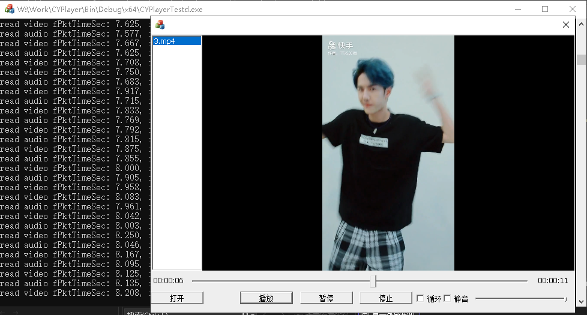

# CYPlayer

<div align="center">

**跨平台高效媒体播放器 SDK** | **Cross-platform Efficient Media Player SDK**

[](LICENSE)
[](https://isocpp.org/)
[](https://ffmpeg.org/)
[](https://www.libsdl.org/)

</div>

## 目录 | Table of Contents

- [简介 | Introduction](#简介--introduction)
- [特性 | Features](#特性--features)
- [架构 | Architecture](#架构--architecture)
- [构建 | Building](#构建--building)
- [使用示例 | Usage Examples](#使用示例--usage-examples)
- [技术实现 | Technical Implementation](#技术实现--technical-implementation)
- [接口文档 | API Reference](#接口文档--api-reference)
- [扩展指南 | Extension Guide](#扩展指南--extension-guide)
- [许可 | License](#许可--license)

## 简介 | Introduction

**CYPlayer** 是一个轻量级、跨平台的媒体播放器 SDK，采用现代 C++11 实现，基于 FFmpeg 和 SDL 开发。它采用**责任链**设计模式，提供模块化和可扩展的播放架构，适用于需要在各种平台上实现高质量媒体播放功能的应用程序。

**CYPlayer** is a lightweight, cross-platform media player SDK implemented in modern C++11, based on FFmpeg and SDL. It adopts the **Chain of Responsibility** design pattern, offering a modular and extensible playback architecture suitable for applications requiring high-quality media playback capabilities across various platforms.



## 特性 | Features

- **模块化架构** - 采用责任链模式，各组件职责明确，易于扩展
- **广泛的媒体格式支持** - 通过 FFmpeg 支持几乎所有主流媒体格式
- **跨平台** - 支持 Windows、macOS、Linux 等多种平台
- **高性能渲染** - 使用 SDL 提供高效的视频渲染
- **纯 C++11 实现** - 无外部绑定或框架依赖
- **易于扩展** - 可插入自定义过滤器或替换核心组件
- **硬件加速** - 支持多种硬件加速方案
- **高级音频处理** - 音频重采样、音量控制、声道管理
- **视频效果** - 支持缩放、旋转、镜像等视频效果
- **事件回调系统** - 丰富的事件通知机制

## 架构 | Architecture

CYPlayer 的设计核心是灵活的处理过滤器链，每个组件都有明确且独立的职责。这种设计使得 SDK 易于扩展和维护。

### 过滤器链结构 | Filter Chain Structure

```
[SourceFilter] → [DemuxFilter] → [DecodeFilter] → [ProcessFilter] → [RenderFilter]
```

- **SourceFilter**: 处理输入源（如本地文件、网络流）
- **DemuxFilter**: 负责流的解复用
- **DecodeFilter**: 解码音频/视频数据
- **ProcessFilter**: 应用后处理（如缩放、特效）
- **RenderFilter**: 通过 SDL 处理音频播放和视频渲染

### 流程图 | Flow Diagram

```
+-------------+ +-------------+ +--------------+ +--------------+ +--------------+ 
| SourceFilter| --> | DemuxFilter | --> | DecodeFilter | --> | ProcessFilter| --> | RenderFilter | 
+-------------+ +-------------+ +--------------+ +--------------+ +--------------+
```

## 构建 | Building

### 先决条件 | Prerequisites

确保您的系统上安装了以下组件:
- CMake (3.10 或更高版本)
- 支持 C++14 的编译器 (MSVC、GCC、Clang)
- FFmpeg 开发库 (4.x 或更新)
- SDL2 开发库 (2.x)

### 构建步骤 | Build Steps

#### Windows

```bash
# 创建构建目录
mkdir build
cd build

# 配置 CMake
cmake .. -DCMAKE_BUILD_TYPE=Release

# 构建
cmake --build . --config Release
```

对于 Visual Studio:

```bash
# 生成 Visual Studio 解决方案
cmake .. -G "Visual Studio 17 2022" -A x64

# 在 Visual Studio 中打开生成的解决方案
start CYPlayer.sln
```

#### macOS 和 Linux

```bash
# 创建构建目录
mkdir build
cd build

# 配置 CMake
cmake .. -DCMAKE_BUILD_TYPE=Release

# 构建
make
```

### 配置依赖项 | Configuring Dependencies

如果 FFmpeg 和 SDL2 没有安装在标准系统位置，可以指定它们的位置:

```bash
cmake .. -DFFMPEG_ROOT_DIR=/path/to/ffmpeg -DSDL2_ROOT_DIR=/path/to/sdl2
```

### 构建选项 | Build Options

- `CMAKE_BUILD_TYPE`: 设置为 `Debug` 或 `Release` (默认: `Debug`)
- `BUILD_TESTS`: 设置为 `ON` 以构建测试可执行文件 (默认: `OFF`)
- `FFMPEG_ROOT_DIR`: FFmpeg 安装路径
- `SDL2_ROOT_DIR`: SDL2 安装路径

### 安装 | Installing

```bash
# 从构建目录
cmake --install . --prefix /path/to/install
```

这将安装:
- 库文件到 `<prefix>/lib/`
- 头文件到 `<prefix>/include/`

## 使用示例 | Usage Examples

### 基本用法 | Basic Usage

```cpp
// 创建播放器实例
cry::ICYPlayer* player = cry::CYPlayerFactory::CreatePlayer();

// 设置播放器参数
cry::EPlayerParam playerParam;
playerParam.eClockType = cry::TYPE_SYNC_CLOCK_AUDIO;
playerParam.eVideoRenderType = cry::TYPE_VIDEO_RENDER_SDL;
playerParam.eAudioRenderType = cry::TYPE_AUDIO_RENDER_SDL;

// 初始化播放器
player->Init(&playerParam);

// 设置窗口句柄 (Windows平台)
#ifdef _WIN32
player->SetWindow(hWnd);
#endif

// 设置回调函数
player->SetEventCallback(PlayerEventCallback);
player->SetStateCallback(PlayerStateCallback);
player->SetPositionCallback(PlayerPositionCallback);

// 打开媒体文件
cry::EPlayerMediaParam mediaParam;
mediaParam.nStartVolume = 100;  // 初始音量
mediaParam.nLoop = 1;           // 循环播放次数
player->Open("path/to/video.mp4", &mediaParam);

// 开始播放
player->Play();

// 暂停播放
bool paused = false;
player->Pause(&paused);

// 恢复播放
player->Play();

// 跳转到指定位置 (毫秒)
player->Seek(30000);

// 设置音量 (0.0 ~ 1.0)
player->SetVolume(0.8f);

// 停止播放并释放资源
player->Stop();
player->UnInit();
cry::CYPlayerFactory::DestroyPlayer(player);
```

### 回调函数示例 | Callback Examples

```cpp
// 事件回调
void PlayerEventCallback(const cry::EPlayerEventInfo* eventInfo) {
    if (!eventInfo) return;
    
    switch (eventInfo->eEventType) {
        case cry::TYPE_EVENT_PLAYBACK_FINISHED:
            std::cout << "Playback finished" << std::endl;
            break;
        case cry::TYPE_EVENT_ERROR_OCCURRED:
            std::cout << "Error: " << eventInfo->nErrorCode << " - " 
                      << eventInfo->szMessage << std::endl;
            break;
        // 处理其他事件...
    }
}

// 状态回调
void PlayerStateCallback(cry::EStateType state) {
    switch (state) {
        case cry::TYPE_STATUS_PLAYING:
            std::cout << "Playing" << std::endl;
            break;
        case cry::TYPE_STATUS_PAUSED:
            std::cout << "Paused" << std::endl;
            break;
        // 处理其他状态...
    }
}

// 播放位置回调
void PlayerPositionCallback(int64_t position, int64_t duration) {
    std::cout << "Position: " << position << " / " << duration << " ms" << std::endl;
}
```

## 技术实现 | Technical Implementation

### 核心架构 | Core Architecture

CYPlayer 基于精心设计的责任链过滤器架构，每个过滤器在链中都有特定职责，并将数据传递给链中的下一个过滤器:

1. **CYBaseFilter**: 所有过滤器的抽象基类，提供:
   - 过滤器操作的通用接口
   - 构建过滤器链的方法 (SetNext, GetNext)
   - 处理数据包和帧的虚拟方法

2. **ChainFilterManager**: 中央协调器，负责:
   - 创建和连接所有过滤器组件
   - 控制播放状态和操作
   - 将命令路由到相应的过滤器
   - 管理事件和回调

### 媒体上下文 | Media Context

`CYMediaContext` 类是一个全面的容器，维护:

- 流信息 (音频、视频、字幕)
- 数据包和帧队列
- 媒体时钟和同步数据
- FFmpeg 上下文 (格式、编解码器、过滤器)
- SDL 渲染资源 (窗口、渲染器、纹理)
- 帧时序和缓冲信息

### 关键组件 | Key Components

#### SourceFilter
打开媒体文件或流并设置格式上下文。

#### DemuxFilter
将容器格式解复用为单独的音频、视频和字幕流。

#### DecodeFilter
CYPlayer 为不同媒体类型提供专门解码器:
- **CYAudioDecodeFilter**: 将音频包解码为原始音频帧
- **CYVideoDecodeFilter**: 将视频包解码为原始视频帧
- **CYSubTitleDecodeFilter**: 处理字幕数据

#### ProcessFilter
执行后处理操作，如:
- 视频缩放和格式转换
- 音频重采样
- 效果应用
- 帧率转换

#### RenderFilter
将媒体渲染到输出设备:
- **CYAudioRenderFilter**: 通过 SDL 处理音频播放
- **CYVideoRenderFilter**: 使用 SDL 将视频帧渲染到显示器

### 同步机制 | Synchronization

CYPlayer 实现了强大的媒体时钟系统 (`CYMediaClock`)，确保同步:
- 音频和视频流之间
- 外部时钟源
- 帧时序和呈现

支持多种同步模式:
- 音频主时钟同步
- 视频主时钟同步
- 外部时钟同步

### 性能优化 | Performance Optimization

SDK 实现了多项性能优化:
- 通过 `CYHWAccel` 支持硬件加速
- 高效的帧队列和缓存
- 线程安全的数据包和帧队列
- 多线程解码和渲染

### 跨平台支持 | Cross-Platform Support

通过以下方式实现跨平台兼容:
- 平台抽象的窗口处理
- 使用 SDL 进行音频和视频输出
- 平台特定功能的条件编译
- 统一渲染 API

### 内存管理 | Memory Management

CYPlayer 广泛使用智能指针进行安全内存管理:
- `SharePtr<T>` 用于共享所有权
- `UniquePtr<T>` 用于独占所有权
- 针对 FFmpeg 资源的自定义智能指针 (AVFreePtr, AVNoFreePtr)

### 回调和事件 | Callbacks and Events

SDK 为客户端应用程序提供全面的事件系统:
- `FunEventCallback`: 媒体事件 (播放完成、错误、缓冲)
- `FunStateCallBack`: 播放器状态变化
- `FunPositionCallBack`: 播放位置更新
- `FunLogCallBack`: 日志和调试信息

## 接口文档 | API Reference

### 主要类 | Main Classes

- **ICYPlayer**: 暴露给客户端应用程序的主接口
- **CYPlayerFactory**: 创建播放器实例的工厂
- **CYPlayerImpl**: ICYPlayer 接口的实现

### 主要功能 | Key Features

- **媒体控制**: 播放、暂停、停止和跳转操作
- **视频调整**: 缩放、旋转、镜像、宽高比
- **音频控制**: 音量、静音、速度
- **高级设置**: 硬件加速、循环播放
- **自定义渲染**: 支持外部渲染窗口

### 主要 API | Key APIs

```cpp
// 初始化和反初始化
int16_t Init(EPlayerParam* pParam);
int16_t UnInit();

// 设置渲染窗口
int16_t SetWindow(void* hWnd);

// 打开媒体文件
int16_t Open(const char* pszURL, EPlayerMediaParam* pParam);

// 播放控制
int16_t Play();
int16_t Pause(bool* bPaused);
int16_t Stop();

// 播放器状态
EStateType GetState() const;
int64_t GetDuration() const;
int64_t GetPosition() const;

// 跳转到指定位置
int16_t Seek(int64_t nTimestamp);

// 设置属性
int16_t SetMute(bool bMute);
int16_t SetLoop(bool bLoop);
int16_t SetSpeed(float fSpeed);
int16_t SetVolume(float fVolume);
float GetVolume();

// 视频设置
int16_t SetVideoScale(EVideoScaleType eScale);
int16_t SetVideoRotation(ERotationType eRotation);
int16_t SetVideoMirror(bool bMirror);
int16_t SetAspectRatio(float fRatio);

// 事件回调设置
int16_t SetEventCallback(FunEventCallback callback);
int16_t SetStateCallback(FunStateCallBack callback);
int16_t SetPositionCallback(FunPositionCallBack callback);
int16_t SetLogCallBack(FunLogCallBack callback);
```

## 扩展指南 | Extension Guide

模块化设计使扩展 CYPlayer 变得容易:

1. 通过继承 `CYBaseFilter` 创建自定义过滤器
2. 实现必要的虚拟方法
3. 使用 `SetNext()` 将过滤器插入链中

自定义过滤器可用于:
- 添加新的媒体格式支持
- 实现自定义视频效果
- 添加分析或媒体处理功能
- 支持专用硬件解码器

### 自定义过滤器示例 | Custom Filter Example

```cpp
class MyCustomFilter : public cry::CYBaseFilter {
public:
    MyCustomFilter() {}
    virtual ~MyCustomFilter() {}

    // 初始化过滤器
    virtual int16_t Init(SharePtr<EPlayerParam>& ptrParam) override {
        // 自定义初始化代码
        return cry::ERR_SUCESS;
    }

    // 处理帧数据
    virtual int16_t ProcessFrame(SharePtr<CYMediaContext>& ptrContext, AVFramePtr& ptrFrame) override {
        // 在此处实现自定义帧处理逻辑
        // 例如: 添加水印、应用滤镜、修改帧属性等
        
        // 处理完成后，将帧传递给链中的下一个过滤器
        if (GetNext()) {
            return GetNext()->ProcessFrame(ptrContext, ptrFrame);
        }
        return cry::ERR_SUCESS;
    }
    
    // 实现其他必要的虚拟方法...
};
```

## 许可 | License

CYPlayer 基于 MIT 许可证发布。这意味着 CYPlayer 是自由软件，可以在学术和商业用途中免费使用。

CYPlayer is licensed under the MIT License. This means that CYPlayer is free software and can be used for both academic and commercial purposes at absolutely no cost.

```
Copyright (C) 2023-2026 ShiLiang.Hao <newhaosl@163.com>

Permission is hereby granted, free of charge, to any person obtaining a copy
of this software and associated documentation files (the "Software"), to deal
in the Software without restriction, including without limitation the rights
to use, copy, modify, merge, publish, distribute, sublicense, and/or sell
copies of the Software, and to permit persons to whom the Software is
furnished to do so, subject to the following conditions:

The above copyright notice and this permission notice shall be included in
all copies or substantial portions of the Software.

THE SOFTWARE IS PROVIDED "AS IS", WITHOUT WARRANTY OF ANY KIND, EXPRESS OR
IMPLIED, INCLUDING BUT NOT LIMITED TO THE WARRANTIES OF MERCHANTABILITY,
FITNESS FOR A PARTICULAR PURPOSE AND NONINFRINGEMENT. IN NO EVENT SHALL THE
AUTHORS OR COPYRIGHT HOLDERS BE LIABLE FOR ANY CLAIM, DAMAGES OR OTHER
LIABILITY, WHETHER IN AN ACTION OF CONTRACT, TORT OR OTHERWISE, ARISING FROM,
OUT OF OR IN CONNECTION WITH THE SOFTWARE OR THE USE OR OTHER DEALINGS IN
THE SOFTWARE.
``` 